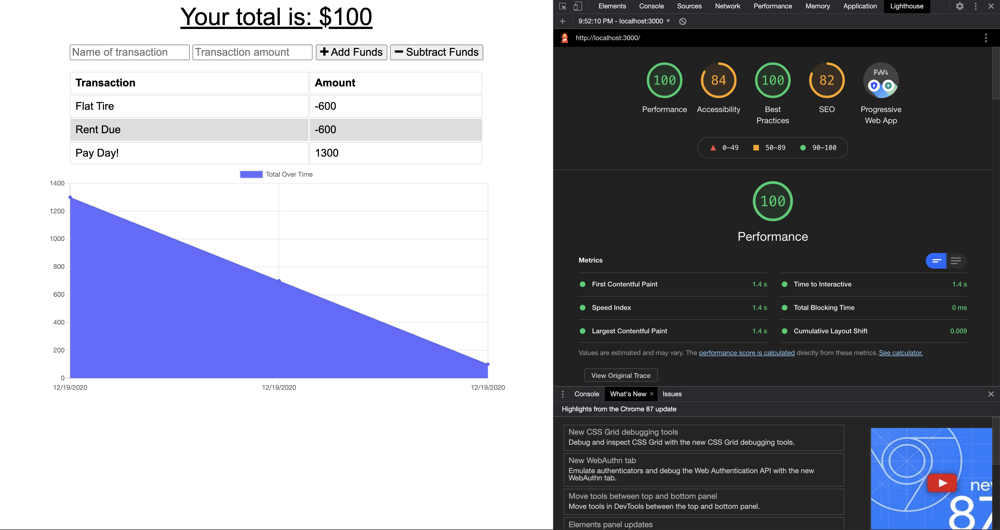

# 💡 Project Title: PWA_Budget_Tracker

## 🕹 Demo:

Video of demo: [PWA_Budget_Tracker_DEMO](https://drive.google.com/file/d/1tUnha7ENERPRSkLXN2M57029qtVSnnaT/view) 

 
## 👤 Author: Joseph Jepson 

  ## 📜 Table of Contents: 

  * [Description](#Description) 

  * [Installation](#Installation) 

  * [Usage](#Usage) 

  * [Contributors](#Contributors) 

  * [Testing](#Testing)

  * [Contact](#Contact) 

  * [License](#License) 

  ## Description: 
A PWA application that lets a user track their budget. Users can add funds or subtract funds. If a user doesn't have access to the internet or goes offline, then this application will still allow them to input their information. Once they have online access again, their input will have been received and the data sent during offline use will rendered saved as if it was taken in during online functionality. 

This application utilizes MongoDB, MongoDB Atlas, Mongoose, and Node.js.

[View Deployment](https://radiant-badlands-41474.herokuapp.com/)

## Installation: 
Clone the repo, and run 'npm install'. 

## Usage: 
Run 'npm run start' to start application. Go to your local host 3000 port to begin using the application.

  ## Contact: 
 
  * 💌  Email: joey@joeyjepson.com 
 
  * 👤  GitHub Username: [alligatormonday](https://github.com/alligatormonday) 
  
  ## Credits: 
 
  * 👤  GitHub User: [Joey Brown](https://github.com/joeybrown-ctrl) - helped me with setting up service worker and indexedDB

  * 👤  GitHub User: [Andrew Moses](https://github.com/andrewmosesdrive) - helped me with refactoring code

  ## License: 
 
  
    MIT License

Copyright (c) 2020 Joseph Jepson

Permission is hereby granted, free of charge, to any person obtaining a copy
of this software and associated documentation files (the "Software"), to deal
in the Software without restriction, including without limitation the rights
to use, copy, modify, merge, publish, distribute, sublicense, and/or sell
copies of the Software, and to permit persons to whom the Software is
furnished to do so, subject to the following conditions:

The above copyright notice and this permission notice shall be included in all
copies or substantial portions of the Software.

THE SOFTWARE IS PROVIDED "AS IS", WITHOUT WARRANTY OF ANY KIND, EXPRESS OR
IMPLIED, INCLUDING BUT NOT LIMITED TO THE WARRANTIES OF MERCHANTABILITY,
FITNESS FOR A PARTICULAR PURPOSE AND NONINFRINGEMENT. IN NO EVENT SHALL THE
AUTHORS OR COPYRIGHT HOLDERS BE LIABLE FOR ANY CLAIM, DAMAGES OR OTHER
LIABILITY, WHETHER IN AN ACTION OF CONTRACT, TORT OR OTHERWISE, ARISING FROM,
OUT OF OR IN CONNECTION WITH THE SOFTWARE OR THE USE OR OTHER DEALINGS IN THE
SOFTWARE.
